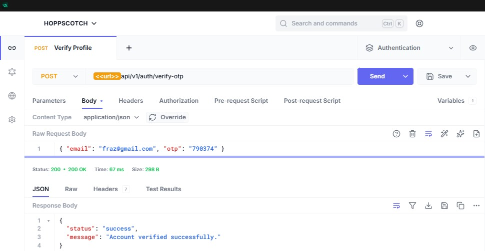

# Production-Grade Authentication & Authorization API

This project is a complete, production-grade REST API for handling user authentication, authorization, and account management. It is built with a modern tech stack and follows best practices for security, scalability, and maintainability.

**Built with:** Node.js, Express, TypeScript, TypeORM (with PostgreSQL), JWT, and Pug for email templates.

**Connect with me:** [LinkedIn](https://www.linkedin.com/in/muhammad-fraz-298900247)

---

## ✨ Features

- **JWT-Based Authentication**: Secure, stateless authentication using JSON Web Tokens.
- **Account Management**: Full user lifecycle management from registration to password reset.
- **Role-Based Access Control (RBAC)**: Middleware to restrict access based on user roles (e.g., `user` vs. `admin`).
- **Secure Password Handling**: Passwords are encrypted using `bcryptjs`.
- **Database Migrations**: Safe and version-controlled database schema management using TypeORM migrations.
- **Input Validation**: Robust request body validation using `Joi` to prevent invalid data.
- **Centralized Error Handling**: A global error handling middleware for consistent and clean error responses.
- **Email Service Integration**: OTP and password reset emails sent via Mailtrap (easily switchable to any SMTP provider).
- **Graceful Token Invalidation**: Old JWTs are automatically invalidated after a password reset.
- **Modern TypeScript & ES Modules Setup**: A clean, modern codebase using the latest TypeScript and Node.js module features.

---

## 🚀 Getting Started

### Prerequisites

- [Node.js](https://nodejs.org/) (v22 or later recommended)
- [PostgreSQL](https://www.postgresql.org/) database
- A [Mailtrap.io](https://mailtrap.io/) account for email testing

### Installation & Setup

1.  **Clone the repository:**

    ```bash
    git clone https://github.com/213020aumc/authentication-authorization-api.git
    cd authentication-authorization-api
    ```

2.  **Install dependencies:**

    ```bash
    npm install
    ```

3.  **Set up environment variables:**
    Create a `.env` file in the root of the project by copying the `.env.example` file.

    ```bash
    cp .env.example .env
    ```

    Now, fill in the `.env` file with your specific credentials for your database and Mailtrap account.

4.  **Set up the database:**

    - Make sure your PostgreSQL server is running.
    - Create a new database with the name you specified in your `.env` file.

5.  **Run database migrations:**
    This command will create all the necessary tables in your database.

    ```bash
    # First, build the project
    npm run build

    # Then, run the migrations
    npm run migration:run
    ```

6.  **Start the development server:**
    ```bash
    npm run dev
    ```
    The server will start on `http://localhost:3000` (or the port specified in your `.env` file) and will automatically restart on file changes.

---

## API Endpoints

All endpoints are prefixed with `/api/v1`.

### Authentication & Account Management (`/auth`)

| Method | Endpoint                | Description                                                | Access |
| :----- | :---------------------- | :--------------------------------------------------------- | :----- |
| `POST` | `/auth/register`        | Creates a new user account and sends a verification OTP.   | Public |
| `POST` | `/auth/login`           | Authenticates a user and returns a JWT access token.       | Public |
| `POST` | `/auth/verify-otp`      | Verifies a user's account using the OTP sent via email.    | Public |
| `POST` | `/auth/resend-otp`      | Resends the verification OTP to a user's email.            | Public |
| `POST` | `/auth/forgot-password` | Initiates the password recovery process by sending an OTP. | Public |
| `POST` | `/auth/reset-password`  | Sets a new password for a user using a valid OTP.          | Public |

### User Management (`/users`)

| Method | Endpoint         | Description                                                          | Access    |
| :----- | :--------------- | :------------------------------------------------------------------- | :-------- |
| `GET`  | `/users/profile` | Returns the profile information of the currently authenticated user. | **User**  |
| `GET`  | `/users/`        | Returns a list of all user profiles in the system.                   | **Admin** |

---

## 📸 API Showcase & Testing

The entire API was meticulously tested using **Hoppscotch** to ensure functionality, security, and robust error handling. The following screenshots demonstrate the key user flows and features.

The Hoppscotch collection provides a complete overview of all available endpoints.


### 1. User Onboarding & Verification Flow

A seamless multi-step process for new users to register and verify their accounts. This flow demonstrates the creation of a user, the automated email response, and final account activation.

| Step   | Action                                                                                                                                          | Screenshot                                                           |
| :----- | :---------------------------------------------------------------------------------------------------------------------------------------------- | :------------------------------------------------------------------- | --- |
| **1a** | **Sending the Request:** A `POST` request is sent to `/auth/register` with the new user's details (name, email, password) in the request body.  |    |
| **1b** | **Receiving the Response:** The API responds with a `201 Created` status, confirming the user was created and an OTP was sent for verification. |  |
| **2**  | **Email Notification:** An automated verification email with a unique OTP is immediately sent to the user's inbox.                              |          |
| **3**  | **Account Activation:** The user's account is successfully verified and activated using the OTP via a `POST` to `/auth/verify-otp`.             |                  |     |

### 2. User Login & Accessing Protected Data

Once verified, a user can log in to receive a JWT and access protected routes.

| Step  | Action                                                                            | Screenshot                                                  |
| :---- | :-------------------------------------------------------------------------------- | :---------------------------------------------------------- |
| **1** | A successful login returns a `200 OK` status and a JWT access token.              |              |
| **2** | The JWT is used as a Bearer token to access the protected `/users/profile` route. |  |

### 3. Secure Password Reset Flow

A complete, secure flow for users who have forgotten their password.

| Step  | Action                                                                          | Screenshot                                                       |
| :---- | :------------------------------------------------------------------------------ | :--------------------------------------------------------------- |
| **1** | The user initiates the process with their email, receiving a `200 OK` response. |    |
| **2** | A dedicated password reset email with a new OTP is sent.                        |  |
| **3** | The user confirms the new password with the OTP, successfully resetting it.     |      |

### 4. Role-Based Access Control (RBAC) in Action

Demonstrating how the API restricts access to admin-only endpoints.

| Scenario           | Result                                                                                                          | Screenshot                                                     |
| :----------------- | :-------------------------------------------------------------------------------------------------------------- | :------------------------------------------------------------- |
| **Access Denied**  | A regular user is correctly denied access to the admin-only `GET /users` endpoint with a `403 Forbidden` error. |  |
| **Access Granted** | An authenticated admin successfully retrieves the list of all users from the same endpoint.                     |  |

### 5. Robust Error Handling

The API provides clear and appropriate error messages for invalid requests.

| Scenario                  | Result                                                                                      | Screenshot                                            |
| :------------------------ | :------------------------------------------------------------------------------------------ | :---------------------------------------------------- |
| **Incorrect Credentials** | A login attempt with the wrong password results in a `401 Unauthorized` error.              |     |
| **Invalid OTP**           | An attempt to verify an account with an incorrect OTP is rejected with a `400 Bad Request`. |  |
